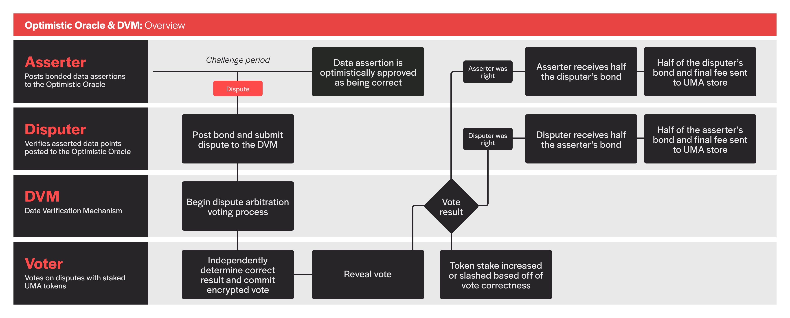

# How does UMA's Oracle work?

UMA's Optimistic Oracle allows contracts to quickly request and receive data information. The Optimistic Oracle acts as a generalized escalation game between contracts that initiate a price request and UMA's dispute resolution system known as the Data Verification Mechanism (DVM). Prices proposed by the Optimistic Oracle will not be sent to the DVM unless it is disputed.

If a dispute is raised, a request is sent to the DVM. All contracts built on UMA use the DVM as a backstop to resolve disputes. Disputes sent to the DVM will be resolved within a few days - after UMA tokenholders vote on what the correct outcome should have been.

<figure><figcaption>
Oracle system diagram
</figcaption></figure>

### Optimistic Oracle

The first part of UMA's oracle system is the Optimistic Oracle. This is a layer that is designed to optimistically verify pieces of data quickly. It is secured by the UMA DVM, because disputes can be escalated from the Optimistic Oracle layer to the DVM for dispute arbitration. The main lifecycle of the OO looks like this, and is detailed in the Asserter and Disputer rows within the diagram above.

1. An Asserter will post a bonded assertion about the state of the world. This assertion will :
   * **identifier:** price identifier being requested.
   * **timestamp:** timestamp of the fact being asserted.
   * **claim:** ancillary data containing additional information about the assertion&#x20;
   * **currency:** ERC20 token used for payment of rewards and fees. Must be approved for use with the DVM.
   * **bond:** a bond size that represents the stake the asserter is putting on their statement being correct.
2. Disputers can refute a piece of data submitted by an Asserter within the assertion liveness period by referencing their own off-chain price feeds and determination methodologies. The liveness period is a pre-defined amount of time a that an assertion can be disputed.
3. If Disputers do not refute the price submitted by the Asserter within the proposal liveness period, the assertion is optimistically treated as being correct.
4. If an assertion is disputed, the assertion will be submitted to UMA’s DVM for dispute arbitration.

### UMA's Data Verification Mechanism

The Data Verification Mechanism (DVM) provides a backstop to the UMA OO by resolving disputes that happen when a proposed/asserted piece of data is disputed.

1. In the event of a dispute, a price request is submitted to the DVM which proposes a vote to UMA tokenholders to report the price of the asset at a specific timestamp.
2. The vote will conclude after a 48-96 hour voting period.
3. UMA tokenholders will reference the price identifier's [UMIP](../community/governance/the-umip-process.md) to determine how to arrive at a vote result via off-chain price feeds and methodologies.&#x20;
4. The DVM will aggregate votes from UMA tokenholders to determine the final price of the asset for a given timestamp.

The DVM is powerful because it encompasses an element of human judgment to ensure contracts are securely and correctly managed when issues arise from volatile (and sometimes manipulatable) markets.

UMA's oracle system is constructed with economic guarantees around the cost of corrupting the DVM to ensure it will cost more to corrupt the oracle (i.e., obtain 51% or more UMA tokens) than the amount someone could profit from corrupting the oracle (i.e. stealing funds within contracts on UMA).
