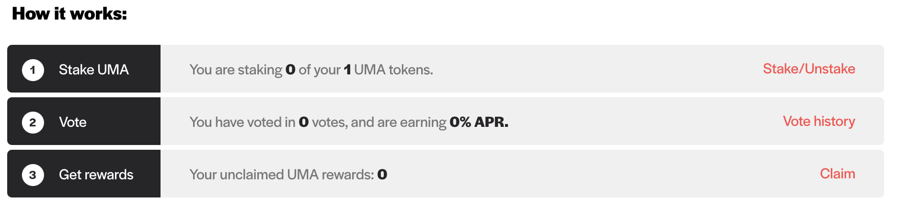

# Providing Oracle Data

This tutorial describes how to propose values for price requests:

**Step 1:** Go to the [Optimistic Oracle dApp](https://oracle.umaproject.org/)

**Step 2:** Locate requests under the Requests tab for outstanding requests

.png>)

**Step 3:** Click on the request you are interested in proposing a price for:

.png>)

**Step 4:** Click the 'Connect wallet' button in the top right corner and go through the steps to connect your wallet. Confirm you are on the same network as the price request.

.png>)

**Step 5:** Before proposing, confirm the details of the request and ancillary data to ensure you are accurately proposing a price:

.png>)

**Step 6:** Once you are sure of the proposed value and connected to your wallet, input the value and click the 'Submit Proposal' button:

**Step 7:** Confirm the transaction details through your wallet provider. After confirming, the proposal will be sent!
